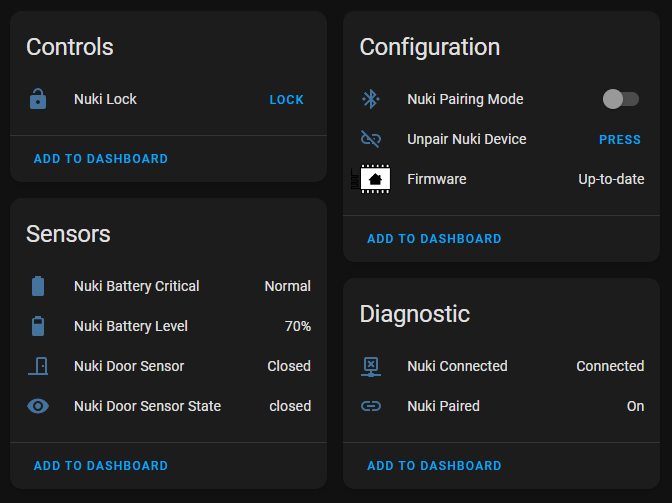

# Nuki Lock for ESPHome (ESP32)
[](https://github.com/uriyacovy/ESPHome_nuki_lock/actions/workflows/build.yaml)

This module builds an ESPHome lock platform for Nuki Smartlock (nuki_lock) that creates 9 new entities in Home Assistant:
- Lock 
- Binary Sensor: Is Paired
- Binary Sensor: Is Connected
- Binary Sensor: Critical Battery 
- Sensor: Battery Level
- Binary Sensor: Door Sensor
- Text Sensor: Door Sensor State
- Switch: Pairing Mode
- Switch: Button Enabled
- Switch: LED Enabled
- Number: LED Brightness
- Button: Unpair

The lock entity is updated whenever the look changes state (via Nuki App, HA, or manually) using Nuki BT advertisement mechanism.




## How to use
Add the following to the ESPHome yaml file:

```yaml
esphome:
  libraries:
  - Preferences
  - https://github.com/h2zero/NimBLE-Arduino#1.4.0
  - Crc16
  - https://github.com/uriyacovy/NukiBleEsp32

external_components:
  - source: github://uriyacovy/ESPHome_nuki_lock

esp32:
  board: "esp32dev"  # Or whatever other board you're using
  framework:
    type: arduino
    version: 2.0.16
    platform_version: 6.7.0

lock:
  # Required:
  - platform: nuki_lock
    name: Nuki Lock
    is_connected:
      name: "Nuki Connected"
    is_paired:
      name: "Nuki Paired"

  # Optional:
    battery_critical:
      name: "Nuki Battery Critical"
    battery_level:
      name: "Nuki Battery Level"
    door_sensor:
      name: "Nuki Door Sensor"
    door_sensor_state:
      name: "Nuki Door Sensor State"
    unpair:
      name: "Nuki Unpair"
    pairing_mode:
      name: "Nuki Pairing Mode"
    button_enabled:
      name: "Nuki Button enabled"
    led_enabled:
      name: "Nuki LED enabled"
    led_brightness:
      name: "Nuki LED brightness"

  # Optional: Settings
    security_pin: 1234
    pairing_mode_timeout: 300s

  # Optional: Callbacks
    on_pairing_mode_on_action:
      - lambda: ESP_LOGI("nuki_lock", "Pairing mode turned on");
    on_pairing_mode_off_action:
      - lambda: ESP_LOGI("nuki_lock", "Pairing mode turned off");
    on_paired_action:
      - lambda: ESP_LOGI("nuki_lock", "Paired sucessfuly");
```

After running ESPHome (esphome run <yamlfile.yaml>), you have to activate the pairing mode of the ESPHome Component to pair your Nuki.
You can use the `Pairing Mode` Switch Entity or use the `nuki_lock.set_pairing_mode` Automation Action to do so.
To set Nuki for paring mode, press the Button on your Smart Lock for 5 seconds until the led turns on.
Once Nuki is paired, the new ESPHome entities will get the updated state and pairing mode is turned off.

## Supported Services ##
### Unlatch ###
To unlatch doors without a handle, call open service from Home Assistant:
```yaml
service: lock.open
data: {}
target:
  entity_id: lock.<NODE_NAME>
```

### Lock and Go
To run lock and go, call this service from Home Assistant: 
```yaml
service: esphome.<NODE_NAME>_lock_n_go
data: {}
```

## Automation ##
### Action: Pairing Mode ###
You can use this action to turn on/off the pairing mode: 
```yaml
on_...:
  - nuki_lock.set_pairing_mode:
      pairing_mode: True
```

### Action: Unpair
You can use this action to unpair your Nuki: 
```yaml
on_...:
  - nuki_lock.unpair:
```

### Callbacks
You can use this callbacks to run specific actions: 
```yaml
on_pairing_mode_on_action:
  - lambda: ESP_LOGI("nuki_lock", "Pairing mode turned on");
on_pairing_mode_off_action:
  - lambda: ESP_LOGI("nuki_lock", "Pairing mode turned off");
on_paired_action:
  - lambda: ESP_LOGI("nuki_lock", "Paired sucessfuly");
```

## Dependencies
The module depends on the work done by [I-Connect](https://github.com/I-Connect) with [NukiBleEsp32](https://github.com/I-Connect/NukiBleEsp32).

## Tested Hardware
- ESP32-WROOM
- ESP32-S3-WROOM
- Nuki smart lock v4
- Nuki smart lock v3
- Nuki smart lock v2
- Nuki door sensor

